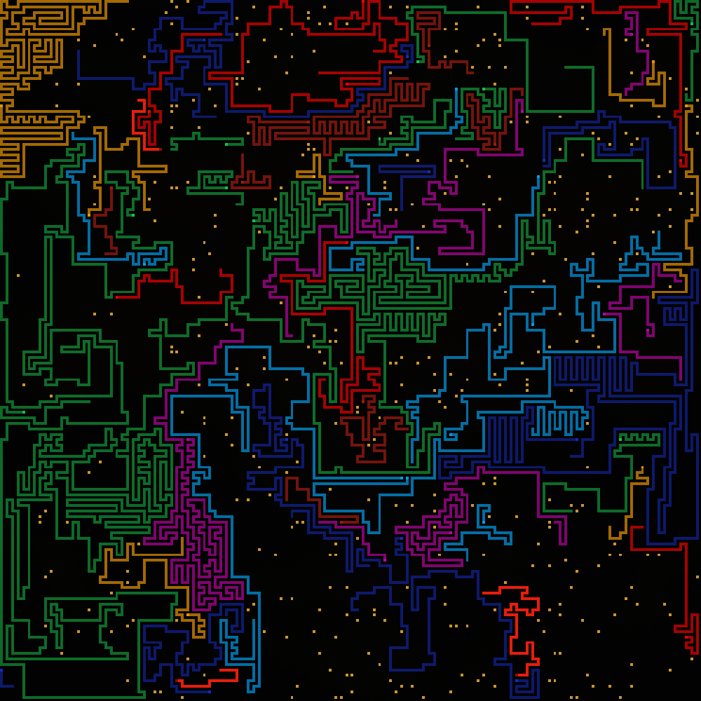
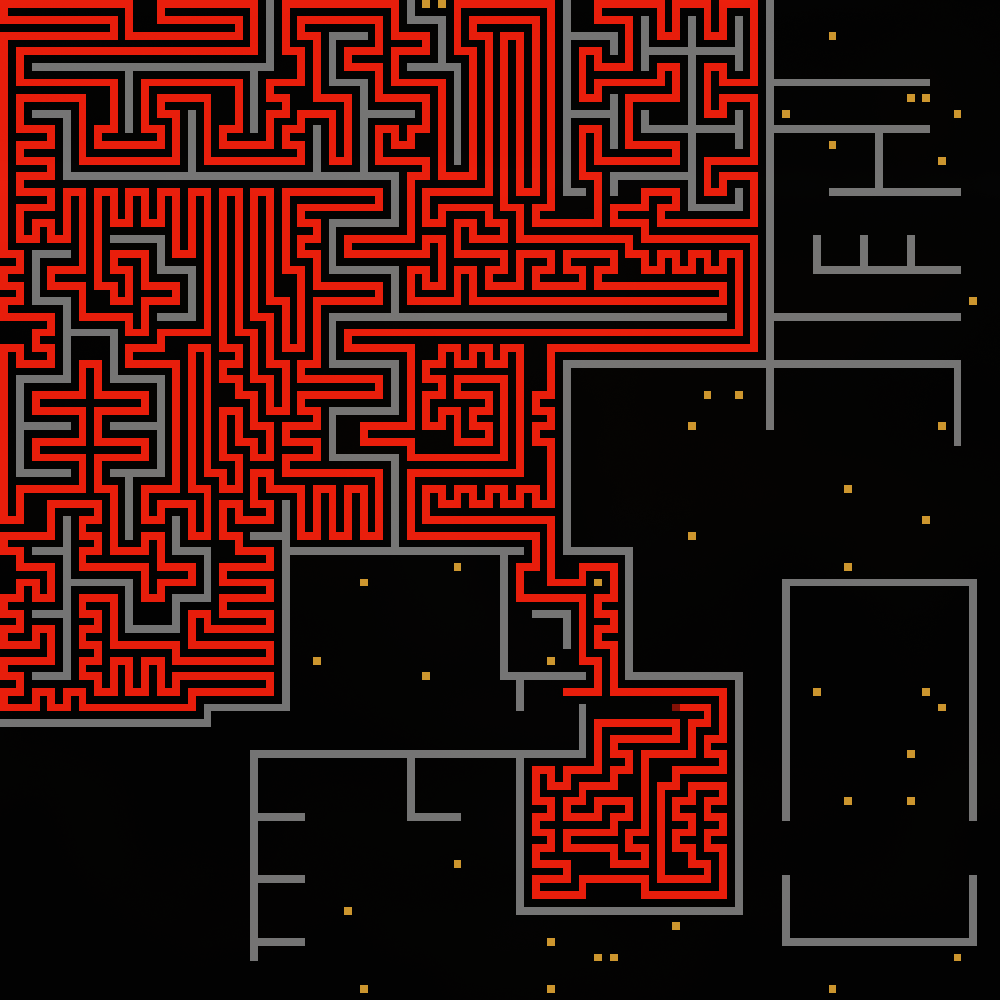
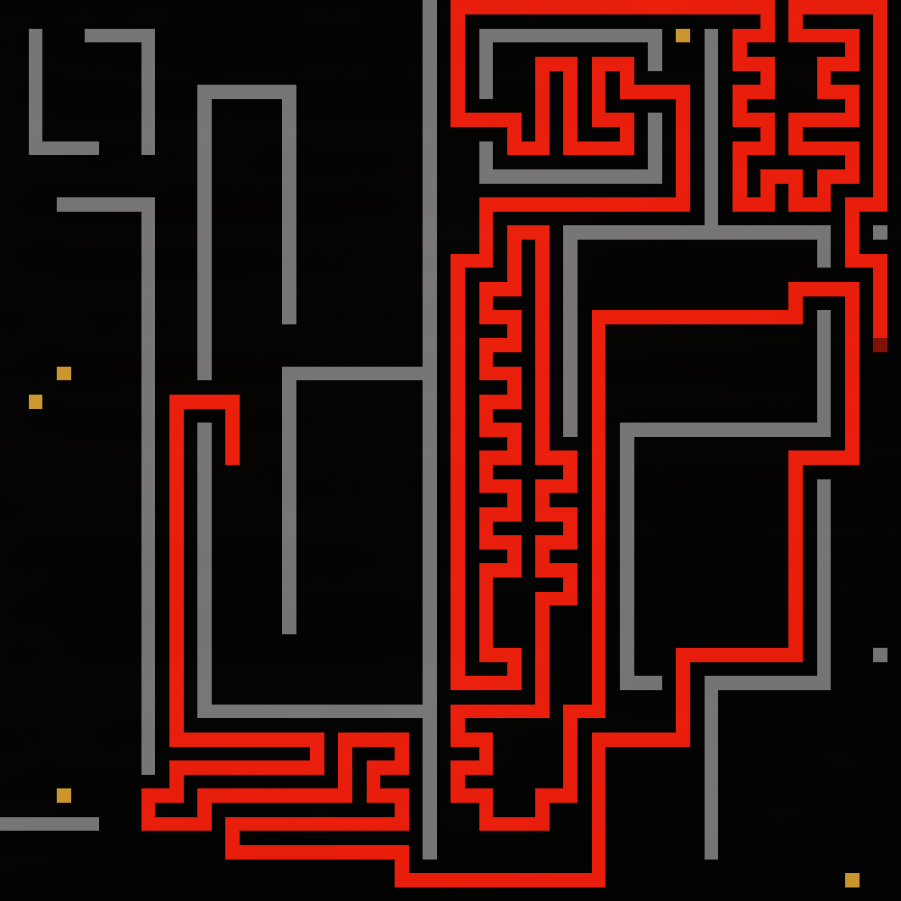

# Snake Sim

A snake simulation environment with support for deep learning snakes.

## Installation (use -e if developing)

### first cd in to repo root

```bash
pip install -e .
```

This installs PyTorch with **CPU support** by default.

### For CUDA/GPU Support

If you want to use GPU acceleration for deep RL snake:


```bash
# First, install PyTorch with CUDA support
pip install torch torchvision --index-url https://download.pytorch.org/whl/cu130

# Then install snake-sim (will use the CUDA PyTorch you just installed)
pip install -e .
```

## Building from Source

If you need to build the C++ extensions manually:

```bash
python setup.py build
python setup.py build_ext --inplace
```

## System Architecture

The snake simulation system is built on a modular architecture with clear separation between environment, snake instances and rendering components. Below is a overview that does not include all objects:


**Key Components:**
- **Environment**: Manages the simulation state, snake updates, and food spawning
- **Snake Updater**: Manages how each type of snake can get updated, GRPC snakes for example can be updated in parallel.
- **Rendering**: Terminal and window-based visualization

## Running on Headless Servers

To run the simulation on a headless server, `xvfb` needs to be installed:

```bash
sudo apt update && sudo apt upgrade
sudo apt install xvfb
```

## Usage

After installation, you can run the snake simulation:

```bash
snake-sim
```


## Interactive Controls (Render Loop)

When running the simulation, you can control the playback using your keyboard. The controls work in both graphical window mode and terminal mode.

### Key Controls:

- **Right Arrow**: Step forward one frame, or hold to play continuously
- **Left Arrow**: Step backward one frame, or hold to rewind
- **Ctrl + Arrow**: Fast forward/rewind (20x speed)
- **Shift + Arrow**: Jump forward/backward 10 frames at a time
- **Spacebar**: Pause/unpause the automatic playback
- **Enter**: Save the current state (if supported)
- **q**, **Esc**, or **Ctrl + C**: Quit the simulation

Make sure the window is active (clicked on) in graphical mode for keys to register. In terminal mode, fast and multi-step controls depend on your keyboard's repeat rate.

If running without a display (headless), controls are disabled. Use command-line options or remote control instead.

Note: On some systems like Wayland, the controls work better with window focus.

## Example Commands

Here are some common ways to run the snake simulation:

```bash

# Run a live simulation with terminal rendering
snake-sim compute --renderer terminal

# Run a live simulation with graphical window (default)
snake-sim compute --renderer window --fps 30

# Run with custom grid size
snake-sim compute --grid-size 20

# Record a simulation to a specific file
snake-sim compute --record-file my_run.json

# Run with 20 snakes and 40 food on map combined4 where the food never decays
snake-sim compute --snake-count 20 --food 40 --food-decay 0 --map combined4

# Run snakes in distributed mode, each snake will run in a separate process.
# Since the algorithm is so much faster now it actually slows it down, this was more
# useful before many big performance optimizations
snake-sim compute --distributed-snakes

# Play a previously recorded simulation file
snake-sim play-file runs/my_simulation.json

```

## Images

### 60 snakes on 128 x 128 grid


### Single snake on 64 x 64 map


### Single snake on 32 x 32 map
